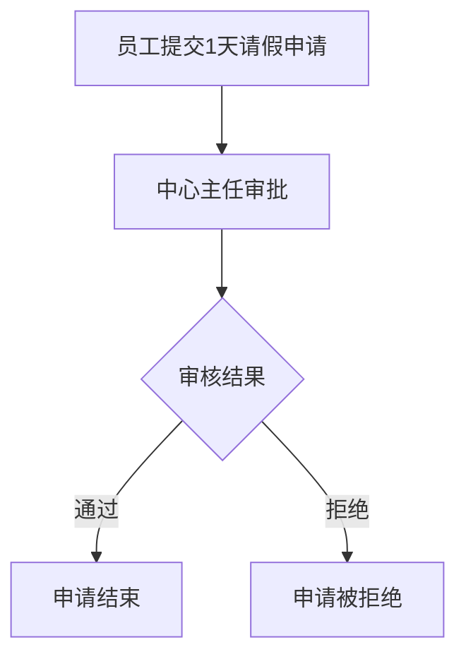
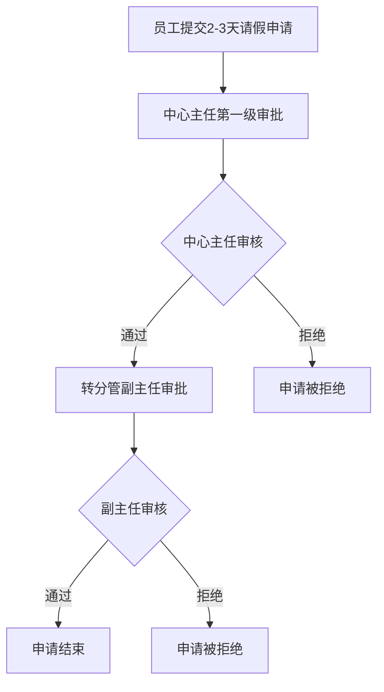
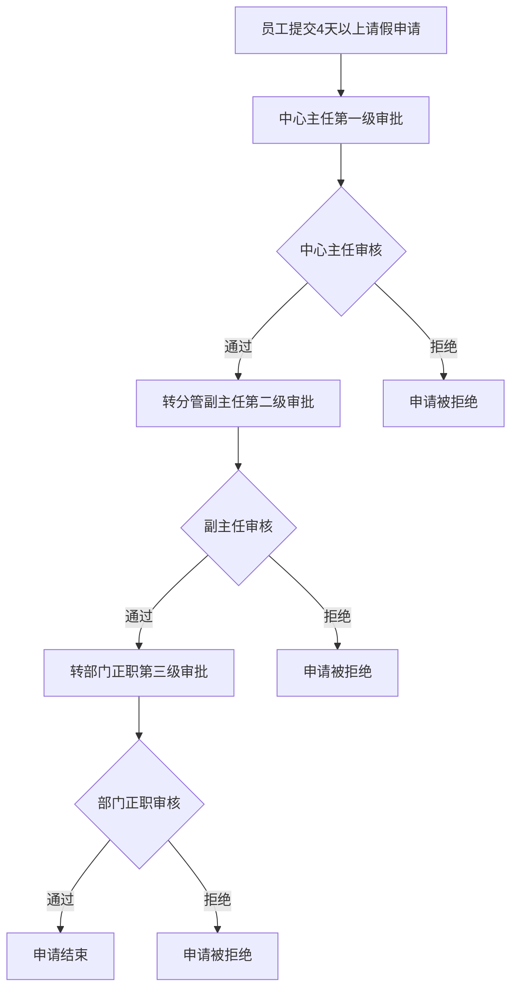
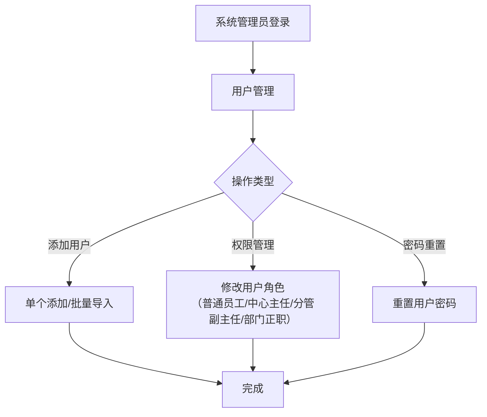

# 请假表单系统 - 业务理解文档

## 系统概述
这是一个基于JWT认证的��假申请管理系统（Sinin），主要用于机构或公司内部的员工请假流程管理。系统采用前后端分离架构，使用Spring Boot后端和TypeScript前端。

## 核心业务模块

### 1. 用户管理模块
**功能范围：** 用户注册、登录、信息管理、权限分配

**用户角色体系：**
- **普通用户：** 可以提交请假申请、查看自己的申请记录
- **审核员（如中心主任）：** 可以审核请假申请、管理用户角色
- **系统管理员：** 可以重置用户密码、导入用户数据

**用户信息字段：**
- 基本信息：用户名、工号、手机号
- 组织信息：申请中心（部门）
- 权限信息：角色
- 微信集成：微信openid绑定

### 2. 请假申请模块
**请假申请流程：**
1. **申请提交：** 员工填写请假信息（类型、时间、原因、天数）
2. **分级审核：** 支持多级审核流程，可指定下一个审核人
3. **状态跟踪：** 实时跟踪申请状态（待审核、已通过、已拒绝）

**请假申请字段：**
- 申请信息：请假类型、开始/结束时间、请假天数、原因
- 申请人信息：用户ID、姓名、申请中心
- 审核信息：审核员ID、姓名、审核备注、状态
- 系统信息：创建时间

### 3. 审核管理模块
**审核功能：**
- **批量审核：** 管理员可以批量处理待审核申请
- **审核记录：** 记录审核意见和处理结果
- **流程控制：** 支持指定下一个审核人（0为最终审批）

**查询功能：**
- **全局视图：** 查看所有请假申请（未处理优先显示）
- **个人视图：** 查看自己的申请记录
- **条件筛选：** 按用户、状态、类型、中心等条件查询

### 4. 系统管理模块
**用户数据管理：**
- **Excel导入：** 批量导入用户信息
- **模板下载：** 提供标准导入模板
- **信息查询：** 支持多条件组合查询用户

**安全管理：**
- **密码管理：** 用户自助修改密码、管理员重置密码
- **微信集成：** 支持微信账号绑定
- **JWT认证：** 基于token的安全认证机制

## 人员组织架构

### 层级结构
```
系统管理员
├── 部门领导
│   ├── 部门正职（主任）
│   └── 分管副主任
└── 中心主任
    └── 普通员工
```

**架构说明：**
- **系统管理员**：唯一拥有系统管理权限，负责系统维护和用户管理
- **部门领导**：分为正职和副职，只有审批权限，不具有管理权限
  - **部门正职（主任）**：拥有最高级别的最终审批权
  - **分管副主任**：拥有中层审批权
- **中心主任**：基层管理岗，负责第一级审批，可以查询用户信息
- **普通员工**：基层工作人员，可以提交请假申请

### 审批权限体系
根据请假天数不同，审批流程分为三级（基于架构图的审批流程）：

**1级审批（1天）：**
- 审批人：中心主任
- 流程：员工申请 → 中心主任审批 → 结束

**2级审批（2-3天）：**
- 第一审批人：中心主任（必须先通过才能到下一级）
- 第二审批人：分管副主任（中心主任通过后才能审批）
- 流程：员工申请 → 中心主任审批 → （通过后）→ 分管副主任审批 → 结束

**3级审批（4天及以上）：**
- 第一审批人：中心主任（必须先通过才能到下一级）
- 第二审批人：分管副主任（中心主任通过后才能审批）
- 第三审批人：部门正职（分管副主任通过后才能审批）
- 流程：员工申请 → 中心主任审批 → （通过后）→ 分管副主任审批 → （通过后）→ 部门正职审批 → 结束

**审批机制特点：**
- **逐级上报**：严格按照基层→中层→高层的顺序进行审批
- **主任双重角色**：部门正职（主任）既有部门领导职能，也承担最终审批职责
- **中心主任作为基层**：在审批流程中担任第一级审批角色
- **系统自动流转**：后端根据请假天数自动确定审批路径和审批人

### 角色权限矩阵

| 功能模块 | 普通员工 | 中心主任 | 分管副主任 | 部门正职（主任） | 系统管理员 |
|---------|---------|---------|-----------|----------------|-----------|
| 提交请假申请 | ✅ | ✅ | ✅ | ✅ | ✅ |
| 查看自己申请 | ✅ | ✅ | ✅ | ✅ | ✅ |
| 审核1天申请（最终审批） | ❌ | ✅ | ❌ | ❌ | ✅ |
| 审核2-3天申请（第一级） | ❌ | ✅ | ❌ | ❌ | ✅ |
| 审核2-3天申请（最终审批） | ❌ | ❌ | ✅ | ❌ | ✅ |
| 审核4天以上申请（第一级） | ❌ | ✅ | ❌ | ❌ | ✅ |
| 审核4天以上申请（第二级） | ❌ | ❌ | ✅ | ❌ | ✅ |
| 审核4天以上申请（最终审批） | ❌ | ❌ | ❌ | ✅ | ✅ |
| 查看待审批申请（仅限自己权限范围内） | ❌ | ✅ | ✅ | ✅ | ✅ |
| 查看所有申请及审批进度 | ❌ | ❌ | ❌ | ❌ | ✅ |
| 修改用户角色 | ❌ | ❌ | ❌ | ❌ | ✅ |
| 重置用户密码 | ❌ | ❌ | ❌ | ❌ | ✅ |
| 批量导入用户 | ❌ | ❌ | ❌ | ❌ | ✅ |
| 用户信息查询 | ❌ | ✅ | ✅ | ✅ | ✅ |

**角色职责说明：**
- **部门正职（主任）**：部门领导，拥有最高级别的审核权，但不具有部门管理权限
- **分管副主任**：协助部门正职，承担中层审批职责
- **中心主任**：基层管理者，负责第一级审批，管理本中心员工
- **系统管理员**：唯一拥有系统管理权限的角色，负责用户管理和系统维护

## 业务流程

### 请假申请流程

#### 1天请假流程


#### 2-3天请假流程


#### 4天及以上请假流程


### 用户管理流程


### 审批工作流程总结

**严格的一级一级向上审批机制（自动化流程）：**

1. **系统自动判断审批级别**
   - 1天 → 1级审批（仅需中心主任审批）
   - 2-3天 → 2级审批（必须中心主任先通过，然后分管副主任审批）
   - 4天以上 → 3级审批（必须中心主任→分管副主任→部门正职依次通过）

2. **自动化审批传递机制**
   - **系统自动路由**：后端根据请假天数自动确定审批流程和下一审批人
   - **无需手动指定**：审批人只需选择"通过"或"拒绝"，系统自动处理后续流程
   - **严格顺序执行**：必须按级别顺序审批，不能跳级
   - **任一环节拒绝即终止**：任何一级审批拒绝，整个申请流程立即结束
   - **自动传递下一级**：当前审批通过后，系统自动传递给下一审批人

3. **审批权限控制**
   - **分级显示待办**：各审批人只能看到当前需要自己审批的申请（前一级已通过，等待自己审批的）
   - **进度透明**：申请人可以看到申请当前在哪一级审批
   - **自动化处理**：审批人无需关心下一审批人是谁，系统自动处理
   - **管理员特权**：系统管理员可以看到所有申请的完整审批进度

4. **审批操作简化**
   - 审批人只需要做两个操作：
     - **通过**：系统自动传递给下一审批人（如果有的话）
     - **拒绝**：流程立即结束，填写拒绝理由
   - **无需选择下一审批人**：系统根据请假天数和审批流程自动决定

5. **审批状态流转**
   ```
   待提交 → 待中心主任审批 →
   （1天通过）→ 已批准
   （2-3天通过）→ [系统自动传递] → 待分管副主任审批 → 已批准
   （4天以上通过）→ [系统自动传递] → 待分管副主任审批 → [系统自动传递] → 待部门正职审批 → 已批准

   任何一级拒绝 → 已拒绝
   ```

6. **后端智能化处理**
   - 根据请假天数自动判断需要几个审批级别
   - 自动找到对应的审批人（中心主任/分管副主任/部门正职）
   - 审批通过后自动创建下一级审批任务
   - 最终审批通过后自动更新申请状态为"已批准"

## 技术特点

### 安全特性
- JWT token认证
- 密码强度验证（6-20位，必须包含字母和数字）
- 微信openid集成

### 数据管理
- 分页查询支持
- 多条件筛选
- Excel批量导入导出
- 数据校验和格式化

### 接口设计
- RESTful API设计
- 统一的响应格式（code、msg、data）
- 完整的CRUD操作
- 详细的API文档

## API接口概览

### 用户相关接口
- `POST /login` - 用户登录
- `GET /my` - 获取当前用户信息
- `POST /` - 更新用户信息
- `PUT /` - 添加新用户
- `POST /admin` - 修改用户角色
- `GET /admin` - 获取审核员列表
- `POST /change-password` - 修改密码
- `POST /admin/reset-password` - 管理员重置密码

### 请假相关接口
- `PUT /from/leave` - 申请请假
- `POST /from/approve` - 审核请假申请（系统自动处理审批流程）
- `GET /from/list` - 获取所有请假申请列表
- `GET /from/my` - 获取当前用户请假申请
- `POST /from/userFrom` - 条件查询用户请假申请

### 管理相关接口
- `GET /all` - 获取所有用户列表
- `POST /info` - 获取用户信息（支持筛选）
- `PUT /excel` - 从Excel导入用户
- `GET /template` - 获取用户导入模板
- `POST /wx` - 绑定微信openid
- `GET /hello` - 健康检查接口

## 数据模型

### 用户模型 (UserVo)
```typescript
interface UserVo {
  id?: number;           // 用户ID
  openid?: string;       // 微信openid
  username?: string;     // 用户名
  role?: string;         // 角色
  phone?: string;        // 手机号
  center?: string;       // 申请中心
  number?: string;       // 工号
}
```

### 请假申请模型 (FromDTO)
```typescript
interface FromDTO {
  id?: number;           // 申请ID
  center?: string;       // 申请中心
  phone?: string;        // 电话
  type?: string;         // 申请类型
  status?: number;       // 申请状态
  startTime?: string;    // 开始时间
  endTime?: string;      // 结束时间
  createTime?: string;   // 创建时间
  reason?: string;       // 申请原因
  day?: number;          // 申请天数
  userId?: number;       // 用户ID
  userName?: string;     // 用户名
  adminId?: number;      // 审核员ID
  adminName?: string;    // 审核员姓名
  remark?: string;       // 审核备注
}
```

## 项目结构说明

### 前端架构
- 基于 TypeScript + React 的前端应用
- 使用 Axios 进行 HTTP 请求
- 自动生成的 API 类型定义 (src/api/axios/Api.ts)

### 配置文件
- `openapi.yaml` - API 接口定义文档
- `src/api/axios/Api.ts` - 自动生成的 API 客户端代码

## 开发规范

### 代码生成
- API 接口代码通过 swagger-typescript-api 自动生成
- 所有接口类型都已在 `src/api/axios/Api.ts` 中定义

### 认证机制
- 所有需要认证的接口都需要在请求头中携带 JWT token
- Token 格式: `Bearer {token}`

### 响应格式
所有接口响应都遵循统一格式：
```typescript
interface Result<T> {
  code: number;    // 状态码
  msg: string;     // 消息
  data: T;         // 数据
}
```

这个系统适合中小型机构或公司的请假管理需求，具有清晰的权限体系、完整的审核流程和便捷的用户管理功能。